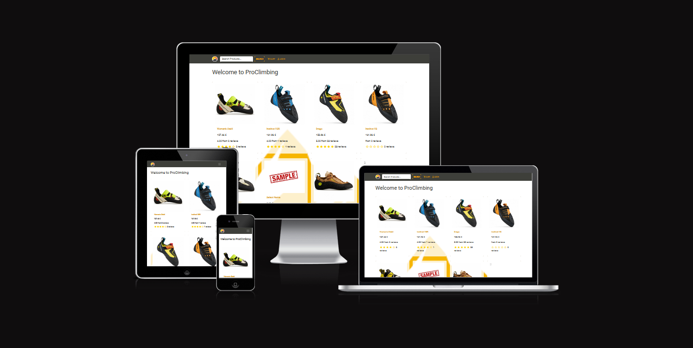
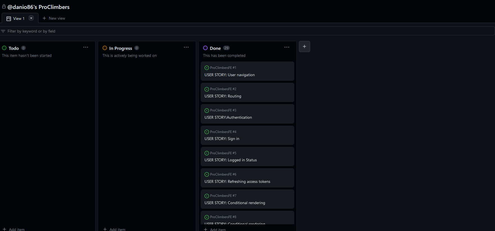
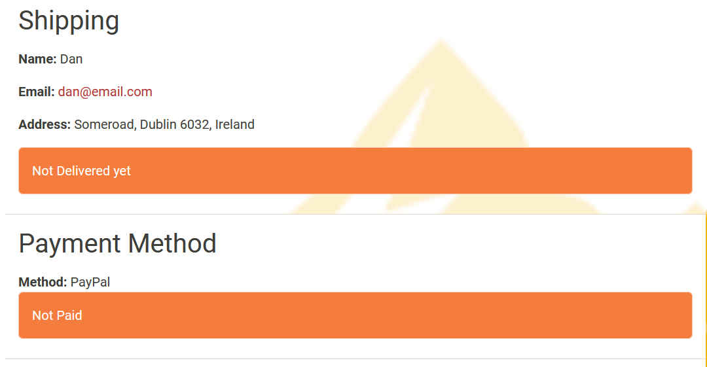
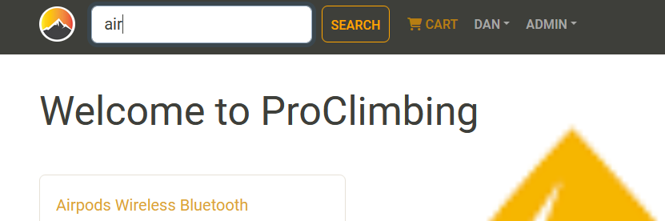
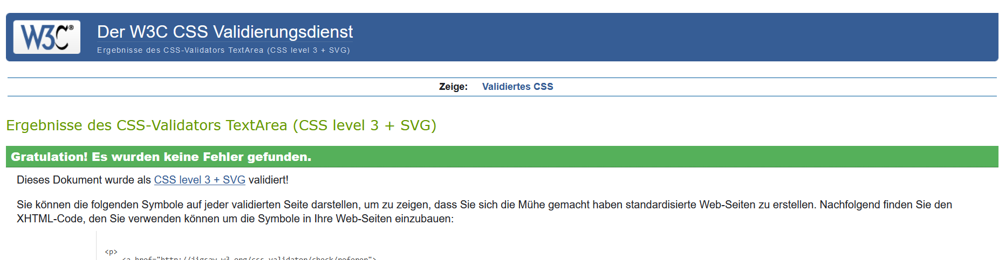
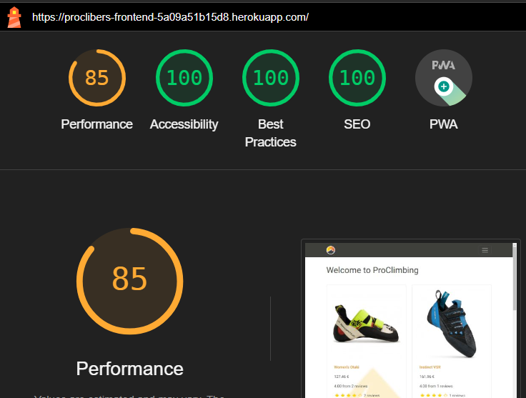

# ProClimbers

ProClimbers is a shop where end users can purchase climbing shoes and, in the future, other outdoor equipment. In this project, the user mainly refers to the shop owner or the admin. There are three different roles in total:

    The shop owner or their employees,
    Logged-in customers with an account, and
    Visitors who are not logged in.

Visitors who are not logged in can browse the products in the shop, but they do not have access to CRUD (Create, Read, Update, Delete) functionality. Logged-in customers can place orders and pay for them in the shop, thus creating order objects. Shop employees, on the other hand, have full CRUD functionality at their disposal. Only the shop owner (a user with admin status) can create and edit products. The owner can also grant admin status to other signed-up users, enabling them to create and update products as well.

The Project can be seen [here](https://proclibers-frontend-5a09a51b15d8.herokuapp.com/)

## User Stories

- **Navigation & Authentication**
  - Navigation: As any kind of user, I can view a navbar from every page so that I can navigate easily between pages.
  - Routing: As any kind of user, I can navigate through pages quickly so that I can view content seamlessly without page refresh.
  - Authentication - Sign up: As a visitor, I can create a new account so that I can access all the features for signed-up customers.
  - Sign in: As a customer or employee, I can sign in to the app so that I can access functionality for logged-in users.
  - Logged in Status: As a user, I can tell if I am logged in or not so that I can log in if I need to.
  - Refreshing access tokens: As a user, I can maintain my logged-in status for 31 days to be able to choose to log out so that my user experience is not compromised.
  - Conditional rendering: 
    - As a logged-out user, I can see sign in and sign up options so that I can sign in/sign up.
    - As an employee, I can navigate to the shop's administration order dashboard, so that I can view all the orders and their status.
    - As an employee, I can navigate to the shop's administration product dashboard, so that I can view all offerings of Proclimbers.
    - As a customer, I can navigate through the ordering process, so that I can order products and pay for them. 

- **The Home Page**
    - As any kind of user, I can search for products with keywords, so that I can find the products with this keyword.
    - As any kind of user, I can click on a product, so that I can get more information about it. 

- **The Product Detail Page**
    - As a logged-in customer, I can view the product page so that I can read the information about the product.
    - As a logged-in customer, I can write comments and rate the product so that other customers can get motivated to buy the product too.
    - As a logged-in customer, I can add the product to my cart, so that I can view my order there.

- **The Cart Page**
    - As a logged-in customer, I can view my order, so that I can get all information about the quantity and the price of my order.
    - As a logged-in customer, I can delete my order, so that I can make my cart empty.
    - As a logged-in customer, I can edit the amount of the product, so that I can choose to buy more or less of the product.
    - As a logged-in customer, I can navigate to the payment process, so that I can buy the product.

- **The Payment Process Pages**
    - As a logged-in customer, I can type in my address, so that the order can be shipped to my place.
    - As a logged-in customer, I can choose a payment method, so that I can pay for the order.
    - As a logged-in customer, I can place the order, so that I can actually order the product.
    - As a logged-in customer, I can view my order, so that I can check if everything is correct.
    - As a logged-in customer, I can click on the pay button, so that I can actually pay for the order.
    - As a logged-in customer, I can view my order, so that I can check if the order is paid or already delivered.

- **The Admin Dashboards**
    - As a shop owner, I can navigate to the admin dashboards for users, orders, and products, so that I can navigate from here to the edit/update pages.
    - As a shop owner, I can click the delete button, so that I can delete products, orders, and users.
    - As a shop owner, I can view all users, products, and orders, so that I can get all the information I need.
    - As a shop owner, I can click the info button on the order dashboard, so that I can check the staus of the oder.

- **The Edit Pages**
    - As a shop owner, I can change attributes of products, so that visitors see other prices, images, etc.
    - As a shop owner, I can create products, so that users can buy them.
    - As a shop owner, I can edit users, so that they have admin status (if they are employees) or different email addresses.
    - As a shop owner, I can view orders, so that I can navigate to the status information.
    - As a shop owner, I can change the order status, so that the order shows up as delivered.

- **The User Pages**
    - As a logged-in user, I can view my user information (Name, email, ...), so that I can change them.
    - As a logged-in user, I can view my orders, so that I can get status information.

## Features 

- __Header__

    - The header contains the ProClimbers name which is a link to the home webpage. The search bar and the link to the Cart page are also included here.
    - The dropdown menus for the user, which contain the logout button and the link to the profile page, and the Admin dropdown menu are located here.
      - The admin dropdown contains the links to all dashboard pages.
        - If the current user is not an admin, this dropdown menu is invisible.
    - The header has a fixed position and can be seen on all webpages at the top of the browser window.
    - On small screens, the header collapses to a dropdown burger button.
    - The header informs the user of the company name and clearly guides the user to all points of interest.
        
        - Header Images
              

      

### The Product Detail Page

- On the product detail page, you can access additional information about the product.
- If you are logged in, you can comment and rate a product here.
- You can also add the product to your shopping cart here.

   - Product page
   
   

### Profile Page

- This page shows all order the user has created and userinformation like email and password.
- The user informormations can be updated here.
- The user can also navigate to the order status here.

  - Profile page
  

### Create-Update-product Page

- If the User has admin status, she or he can create or upate, which is technically the same, a product here.
- All filds ore optional or have default values.
    - Edit product page
    

### Update User and Order Pages

- If the User has admin status, she or he can upate order and user here.
- If a user is an employee of Proclimbers the chef can make this user an admin.
- If a product is already paid, an admin can set the order status to delivered
    - Update user page
    
    - Update Order page
    

### order and pay process Pages

- This process contains severral pages
  - The user can change the amount of products her and gets an overview about all pices
  - The user can choose the paypal or credid card to pay (at the moment only paypal)
  - The user can pay the product
    - To test this a sandbox test paypal account is suggested.

    - Udate user page
    
    - Udate Order page
    
    - Udate Order page
    
    - Udate Order page
    

### 404 Page

- If the user clicks on a link that goes nowhere, they will be directed here.
     - 404 page
    

## Login - Sign Up - Page

- These pages are customised, so that a user needs to login with email address
- If user is already logged in, she or he cannot login again
- If a user is logged in a loout button appears in the user dropdownmenu

  - Login
  
  - Sign Up
  

## Features Left to Implement

  - Planned features: 
    - In the future, an admin will be able to add additional images to their products.
    - Users can add a profile image
    - The page gets a logo

## Components

### The Homepage

- The homepage is the starting page where you can see all products in three columns. You can scroll down here and click on individual products to get detailed information. Additionally, you can also view filtered search results here.
- On smaller screens, you will see only one column instead of three.

    - Landing Page

### Checkout

- The Checkout Component is used in the payment process. It is a bar which is displayed on top of the Shipping page, on the payment page and on the place order page. It shows the progress in the ordering process and changes the color on each single step.
    - Checkout
    

### Footer

- The Footer component is used on every page and shows the copyright and the company's name.
    - Footer
    

### Forms

- The Forms component is used on every page where a form is displayed like on the login page or on the payment page and all the other form pages. It is styled with React Bootstrap and centers all forms, so that all forms look consistently similar.

### Loading Spinner

- The Loading Spinner component is a loading wheel from React Bootstrap which is turning as long as something loads. It is styled with React Bootstrap and displayed on basically every page where content needs to be loaded like on the homepage, the Order page, etc.
    - Loading Spinner
    

### Message
- The Message component is a React Bootstrap alert method. It shows different types of messages like error messages or success messages. The messages can have a default text or a customized text and the messages can be colored with React Bootstrap. This component is used where the user has to fill out a form, like on the sign-up page.
    - Message
    

### Not Found
- If the user clicks on a link that goes nowhere, they will be directed here. This component is placed in Apps.js and used as a page. 
     - 404 page
    

### Products
- The Products component is a React Bootstrap Cart component which shows all the products with information like price, name, etc. It is used only on the homepage and styled with Bootstrap.

### Rating
- The Rating component is used to rate the products. The user can comment on the products and rate the products with Font Awesome stars. The stars are filled yellow. The amount of color which fills the stars is calculated with user values sent to the component. The stars can be empty, half full or completely full. The component is used on the product page and in the product component.
    - Rating
    

### Searchbar
- The Searchbar component is placed in the header component and filters the products by name or parts of the name.
    - Searchbar
    

## Testing 

- I have manually tested the program in the Code institute Heroku terminal and in my local terminal.by doing the following:
    - I have tested that the website works in different browsers (Chrome and Firefox).
    - I confirm that the website works and looks good on all standard screen sizes. This was tested with the devtools divice toolbar.
    - I confirm that the all forms are working.
    - I confirm that the the user can create, edit and delete products and orders.
    - Components are tested with `test.js` files, such as `NavBar.test.js`.
    - This test imports modules like `@testing-library/react`, `react-router-dom`, `react-redux`, and `redux` to render and test the `Header` component.
    - A mock reducer simulates a logged-in user state, used to create a mock Redux store.
    - Three tests are performed:
    - 'renders header' checks for an image with alt text 'ProClimbing'.
    - 'renders userdropdown if the user is logged in' checks for the text 'Username'.
    - 'renders login link if the user is not logged in' checks for the text 'LogIn'.
    - The `Header` component is rendered within a `Provider` and `BrowserRouter` for each test, using `@testing-library/react` for rendering, querying, and assertions.
    - Manual Test
    

### Validator Testing

  - HTML
      - No errors were returned when passing through the official W3C validator.
      - All web pages have been tested.

  - CSS
      - No errors were found when passing through the official (Jigsaw) validator.

  - JavaScipt
      - No errors were found when passing through the JSHint validator.
        

  - Accessibility
      - I confirm that the colors and fonts selected are easy to read and accessible. This was discovered using lighthouse in devtools.
      - All web pages have been tested for desktop and mobil devices.

- HTML Validation

- CSS Validation

- JSX Validation
    - with ES-Linter

- Lighthouse

### Unfixed Bugs

 - No Bugs are unfixed.

## Deployment

The project was deployed using Code institut's mock for Heroku

    Steps for deployment:
    - This repository was cloned.
    - A Herroku app was created on [Heroku](https://dashboard.heroku.com/apps)
    - The Heroku app was linked to the repository
    - The App was connected to the [proClimbers backend project](https://proclimbers-backend-d69c858b50d1.herokuapp.com/)
        - For this, settings had to be made in package.json (proxy) and in axiosDefaults.js
    - Deploy was clicked.

The live link can be found [here](https://proclibers-frontend-5a09a51b15d8.herokuapp.com/)

## Credits 

### Content

- Instructions on how to structure full stack projects, how to work with databasis, how to use Django, and Postgresql  are from [Code Institute - Moments and drf](https://learn.codeinstitute.net/courses/course-v1:CodeInstitute+RA101+2021_T3/courseware/70a8c55db0504bbdb5bcc3bfcf580080/953cd4e5015f483bb05263db3e740e19/)
[and](https://learn.codeinstitute.net/courses/course-v1:CodeInstitute+DRF+2021_T1/courseware/f775d54df4da44d18309888b3fe884f7/bc5fbada70104d489aa0363a03d8bda8/)
- All icons were taken from [Font Awesome](https://fontawesome.com/)
- The code of the header dropdown menu is taken from Bootstrap. [Bootstrap](https://getbootstrap.com/docs/4.1/components/navbar/)
- Most styling components are from Bootstrap. [Bootstrap](https://react-bootstrap.netlify.app/docs/components/accordion)
- The basic style is from [Bootwatch](https://bootswatch.com/) -> Sandstone
- The all HTML structures are from Bootrap. [Bootstrap](https://getbootstrap.com/docs/4.1/layout/grid/)
- The Basic Project idea is from [Youtube](https://www.youtube.com/watch?v=_ELCMngbM0E&list=PL-51WBLyFTg0omnamUjL1TCVov7yDTRng)
- Instructions on how to upload Images in a form arefrom [stackoverflow](https://stackoverflow.com/questions/73269211/form-file-for-image-upload-not-working-in-react)

- Instructions on how to use redux for better understanding of what happens when, to see wich action is fired anf for bugfixig is taken from [Youtube](https://www.youtube.com/watch?v=u3KlatzB7GM&list=PL0Zuz27SZ-6M1J5I1w2-uZx36Qp6qhjKo)
- Instructions on how to use [JWT]https://jwt.io/ to check for token information is taken from CodeInsttute
- Instructions on how to use Postman to check the api calls with different authentification levels are taken from  [Youtube](https://www.youtube.com/watch?v=_ELCMngbM0E&list=PL-51WBLyFTg0omnamUjL1TCVov7yDTRng)
- Instruction on how to calculate the rating start count is taken from [npm](https://www.npmjs.com/package/react-rating-stars-component)

- Color-Scheme
  

### Libraries

 - React: Core library for building user interfaces.
 - React-DOM: Handles rendering of React components in the DOM.
 - React-Scripts: Set of scripts from create-react-app for starting, building, and testing a React app.
 - React-Router-Dom: Routing library for React, allows creation of multiple routes.
 - React-Bootstrap and Bootstrap: Used for styling React components.
 - React-Redux: State management library for React apps, used for storing and managing global state.
 - Axios: Used for making HTTP requests from the browser to the server.
 - Jwt-decode: Used for decoding JSON Web Tokens (JWTs), commonly used for authentication.
 - React-PayPal-Button-V2: Provides a PayPal button component for React.
 - @Testing-Library/React, @Testing-Library/Jest-Dom, @Testing-Library/User-Event: Used for testing React components.
 - Redux-Thunk: Middleware for Redux, allows action creators to return a function instead of an action.
 - Redux-Devtools-Extension: Allows use of Redux DevTools for debugging Redux state.

### Media

- The product images are from this open Source site [berg-freunde](https://www.berg-freunde.at/kletterschuhe/)
- The background image is from [PinnacleBarber](https://m.facebook.com/PinnacleBarber/)
- The logo is from [Vecteezy](https://de.vecteezy.com/vektorkunst/1968154-berg-logo-bilder)
    - I have no right to use these images commertially!

### Personal Advice

  - Thank You!
    -  Jubril Akolade
    - All people from my Slack Group!